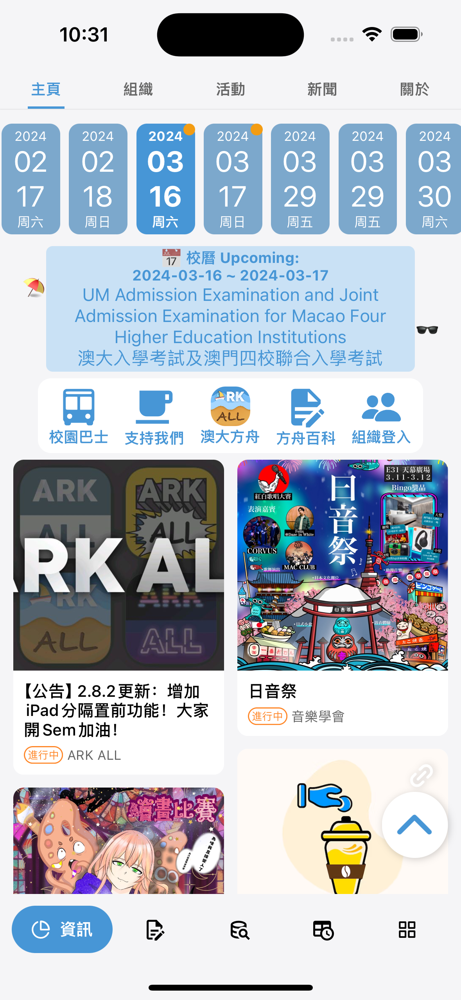
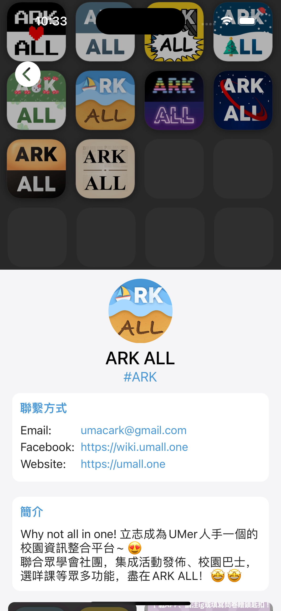
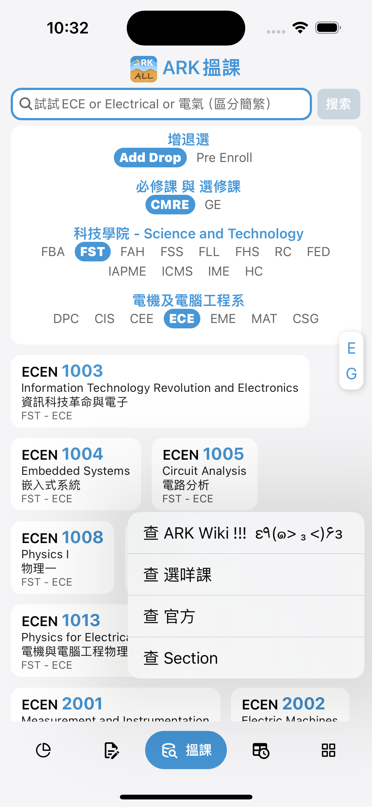
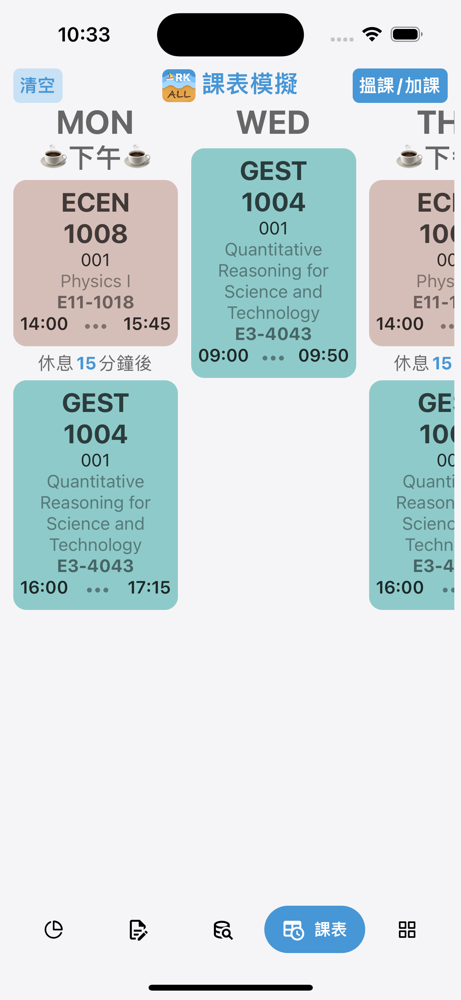
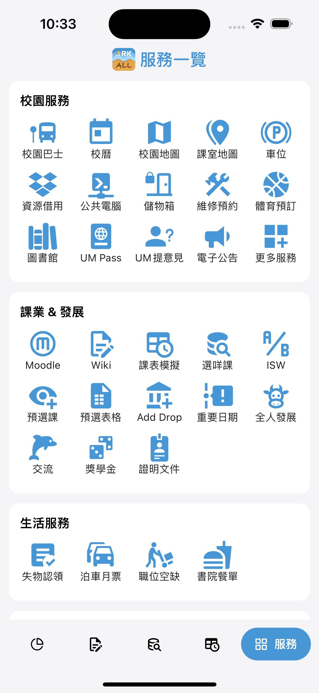
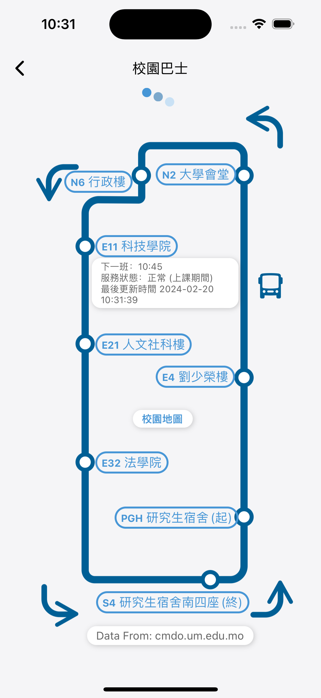
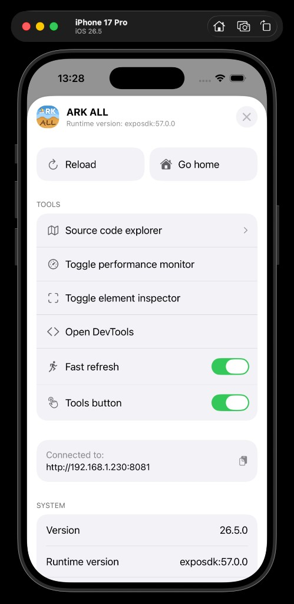

## **🎉ARK ALL 是一個免費的開源 APP🎉**
[](https://github.com/UM-ARK/UM-All-Frontend/releases/latest)

<div align="center">
<a href="https://apps.apple.com/app/id1636670554" style="display:inline-block;">
  
</a>
<a href="https://play.google.com/store/apps/details?id=one.umall" style="display:inline-block;">
  
</a>
</div>

-   感興趣的話可以來 Wiki 看看更多[關於 ARK 的故事](https://wiki.umall.one/wiki/ARK_ALL)~
-   如果 ARK ALL 有幫助到您，可以請我們[喝杯咖啡](https://github.com/UM-ARK/Donate)！
-   如果您也想參與到 ARK ALL 的開發中，立即聯繫我們 `umacark@gmail.com`！

<div align="center">

**APP熒幕截圖**

|                                                                      |                                                                    |                                                                  |
| :------------------------------------------------------------------: | :----------------------------------------------------------------: | :--------------------------------------------------------------: |
|            |          |  |
|  |  |          |

</div>

- [**🎉ARK ALL 是一個免費的開源 APP🎉**](#ark-all-是一個免費的開源-app)
- [🎉 首次運行該項目](#-首次運行該項目)
  - [🤖 Android 環境 Setup](#-android-環境-setup)
  - [🍎 iOS 環境 Setup](#-ios-環境-setup)
    - [React Native 預編譯依賴下載失敗](#react-native-預編譯依賴下載失敗)
  - [📘 Expo CNG 工作流說明](#-expo-cng-工作流說明)
- [🌈 開發本項目準備](#-開發本項目準備)
  - [⛵ 啟動流程](#-啟動流程)
    - [🔑 UM Open Data API Token 配置](#-um-open-data-api-token-配置)
    - [📋 Firebase 配置文件說明](#-firebase-配置文件說明)
      - [`google-services.json` 模板結構](#google-servicesjson-模板結構)
      - [`GoogleService-Info.plist` 模板結構](#googleservice-infoplist-模板結構)
    - [🤖 Android 運行](#-android-運行)
    - [🍎 iOS 運行](#-ios-運行)
      - [模擬器截圖（狀態列）](#模擬器截圖狀態列)
    - [配置Firebase](#配置firebase)
  - [🐛 如何 Debug?](#-如何-debug)
    - [重新打開 Dev Menu / 開啟 Tools button](#重新打開-dev-menu--開啟-tools-button)
      - [方法 1：重新打開 Dev Menu](#方法-1重新打開-dev-menu)
      - [方法 2：通過 Expo CLI 快捷鍵](#方法-2通過-expo-cli-快捷鍵)
    - [Google Firebase Analytics](#google-firebase-analytics)
- [📦 打包方式](#-打包方式)
  - [🍎 iOS 打包](#-ios-打包)
    - [方式一：使用 Expo 構建（推薦）](#方式一使用-expo-構建推薦)
    - [方式二：本地 Xcode 構建（傳統方式）](#方式二本地-xcode-構建傳統方式)
    - [本地 Release 真機除錯（不走 EAS）](#本地-release-真機除錯不走-eas)
  - [🤖 Android 打包](#-android-打包)
    - [方式一：使用 Expo 構建（推薦）](#方式一使用-expo-構建推薦-1)
    - [方式二：本地 Gradle 構建](#方式二本地-gradle-構建)
    - [本機 Release 簽名設定](#本機-release-簽名設定)
  - [🐛 故障排除](#-故障排除)
- [⛵ 維護須知](#-維護須知)

---

## 🎉 首次運行該項目

在此查看[已知 BUG](./README/debugging_doc.md#android%E9%96%8B%E7%99%BC%E7%92%B0%E5%A2%83)，現在可以參考`./AGENTS.md`文件看項目說明了~~AI萬歲~~。

### 🤖 Android 環境 [Setup](https://reactnative.dev/docs/environment-setup)

1. 確保自己是 `Android API 33` 或 `API 31` 的模擬器環境，下載安裝 JDK、SDK
2. 在項目根目錄(`package.json`所在的目錄)打開命令行運行 `yarn install` 安裝依賴
3. 執行 `npx expo prebuild --clean` 生成 Android 原生項目
   - 僅生成 Android：`npx expo prebuild --clean --platform android`
   - 僅生成 iOS：`npx expo prebuild --clean --platform ios`
   - 如安裝了跨平台庫，直接使用 `npx expo prebuild --clean` 生成兩個平台
4. 前往 `Android Studio` 啟動所需的模擬器
5. 敲入 `yarn android` 運行本項目吧!

---

### 🍎 iOS 環境 [Setup](https://reactnative.dev/docs/environment-setup)

> 基於 Expo SDK 57 + React Native 0.86，iOS APP 目前只能在 Mac 開發調試

1. 先安裝`node`包（Node ≥18），方便之後使用指令

```console
brew install node
brew install watchman
```

2. 確保安裝了 `Xcode` (版本 15 或以上)，建議在[官網](https://developer.apple.com/download/all/?q=Xcode)下載
3. 在項目根目錄(`package.json`所在的目錄)打開命令行運行 `yarn install` 安裝依賴
4. 執行 `npx expo prebuild --clean` 生成 iOS 原生項目
   - 僅生成 iOS：`npx expo prebuild --clean --platform ios`
   - 僅生成 Android：`npx expo prebuild --clean --platform android`
   - 如安裝了跨平台庫，直接使用 `npx expo prebuild --clean` 生成兩個平台

5. 使用 Expo 運行 iOS（**不需要手動管理 CocoaPods**）

```console
yarn ios          # 運行 iPhone 16 Pro 模擬器
yarn iosNew       # 運行 iPhone 17 Pro 模擬器
yarn iosTrue      # 運行到真實設備
yarn iosBig       # 運行 iPad Pro 13-inch 模擬器
```

> **注意**：Expo CNG 會自動處理 iOS 原生代碼生成和 CocoaPods 依賴，無需手動運行 `pod install` 或 `prebuild`。首次運行 `yarn ios` 時會自動生成原生項目文件。

#### React Native 預編譯依賴下載失敗

如果 prebuild 後運行 iOS 時出現 `ReactNativeFeatureFlagsDefaults.h`、`react_native_assert.h` 或 `folly/dynamic.h` 等 header 找不到，可能是當前網絡對 Maven Central 的 React Native 預編譯依賴檢查返回 HTTP 403，令 CocoaPods 回退至從源碼編譯。

可改用 Maven mirror 重新生成 iOS 原生項目：

```console
env ENTERPRISE_REPOSITORY=https://maven.aliyun.com/repository/central npx expo prebuild --clean --platform ios
```

生成後確認 `ios/Podfile.lock` 包含 `React-Core-prebuilt` 和 `ReactNativeDependencies`：

```console
rg -n "React-Core-prebuilt \(|ReactNativeDependencies \(" ios/Podfile.lock
```

然後在同一 mirror 設定下運行 iOS：

```console
env ENTERPRISE_REPOSITORY=https://maven.aliyun.com/repository/central yarn iosNew
```

此方案只適用於預編譯依賴探測或下載受阻的情況，無需修改 `node_modules`、Pod header search paths 或 `useFrameworks` 設定。

---

### 📘 Expo CNG 工作流說明

項目使用 **Expo CNG (Continuous Native Generation)** 自動管理原生項目：

| 操作         | 命令                             | 說明                                                           |
| ------------ | -------------------------------- | -------------------------------------------------------------- |
| 安裝依賴     | `yarn install` 或 `expo install` | 推薦使用 yarn                                                  |
| 生成原生項目 | `npx expo prebuild --clean`      | **首次運行前必須執行**，可加 `--platform ios/android` 指定平台 |
| ------       | ------                           | ------                                                         |
| 運行 iOS     | `yarn ios`                       | 運行 iOS 模擬器或真機                                          |
| 運行 Android | `yarn android`                   | 運行 Android 模擬器                                            |

**重要**：
- **首次運行前必須先執行 `npx expo prebuild --clean`** 生成原生項目文件
- 生成後會創建 `./ios` 和 `./android` 目錄
- **無需手動運行 `pod install`**：Expo CNG 會自動處理
- 如果遇到原生構建問題，可重新運行 `npx expo prebuild --clean` 重新生成

---

## 🌈 開發本項目準備

### ⛵ 啟動流程

1. 克隆倉庫的代碼到本地（推薦使用`GitHub Desktop`）

```console
git clone https://github.com/UM-ARK/UM-All-Frontend.git
```

2. 在項目根目錄下(`./package.json`所在的目錄)啟動 Terminal/命令行安裝依賴包

```console
yarn install
# 或使用 expo install（自動處理依賴兼容性）
expo install
```

3. 執行 `npx expo prebuild --clean` 生成 iOS/Android 原生項目
   - 僅生成 iOS：`npx expo prebuild --clean --platform ios`
   - 僅生成 Android：`npx expo prebuild --clean --platform android`
   - 如安裝了跨平台庫，直接使用 `npx expo prebuild --clean` 生成兩個平台

4. 配置 **UM Open Data API Token**（新聞、活動、停車場即時資料等 `api.data.um.edu.mo` 請求需要 `Authorization`）。請見下方 [🔑 UM Open Data API Token 配置](#-um-open-data-api-token-配置)。

#### 🔑 UM Open Data API Token 配置

程式透過 `src/utils/pathMap.js` 匯出的 `UM_API_TOKEN` 讀取 **`process.env.EXPO_PUBLIC_UM_API_TOKEN`**（Expo 會在打包／開發時把 `EXPO_PUBLIC_*` 內嵌進 JS，因此必須使用此前綴）。

**本機開發**

1. 在專案**根目錄**（與 `package.json` 同層）新增 `.env` 或 `.env.local`。
2. 寫入一行（將值換成你向澳大 Open Data 申請到的金鑰，勿使用範例字串）：

```bash
EXPO_PUBLIC_UM_API_TOKEN=你的_UM_Open_Data_Token
```

3. 修改環境變數後請**重新啟動 Metro**；若仍讀不到，可嘗試 `yarn start --clear` 清快取再啟動。

**版控與安全**

- `.env`、`.env.local` 與歷史上的 `umAPIToken.json` 均已列於 `.gitignore`，**請勿把真實 Token 提交到 Git**。
- 舊版文件曾要求根目錄 `umAPIToken.json`；**目前程式碼已不再讀取該 JSON**，請改用上方的 `EXPO_PUBLIC_UM_API_TOKEN`。

**EAS / 雲端建置**

- 雲端機器不會自動帶上你電腦裡的 `.env`。使用 EAS Build 時，請在 [Expo 專案 Environment variables](https://docs.expo.dev/eas/environment-variables/) 為對應建置 profile 設定同名變數 `EXPO_PUBLIC_UM_API_TOKEN`，否則正式版中相關 API 可能無法通過驗證。

**取得 Token**

- 請依澳門大學 Open Data／Data API 官方流程申請；維護者或團隊內部文件會說明申請管道與權限範圍。開源貢獻者若無金鑰，與上述 API 有關的畫面可能無法取得資料，屬預期行為。

5. 需要配置 Firebase 配置文件（用於 Analytics 等功能）：

#### 📋 Firebase 配置文件說明

本項目需要以下 Firebase 配置文件：

| 平台    | 文件路徑                                 | 用途                            |
| ------- | ---------------------------------------- | ------------------------------- |
| Android | `google-services.json`（項目根目錄）     | Firebase Analytics、Crashlytics |
| iOS     | `GoogleService-Info.plist`（項目根目錄） | Firebase Analytics、Crashlytics |

**獲取方式：**
1. 前往 [Firebase Console](https://console.firebase.google.com/) 創建項目
2. 註冊 Android/iOS 應用（包名：`one.umall`）
3. 下載配置文件並放到對應目錄

**如果只需運行項目（不使用 Firebase 功能）：**

可以嘗試使用空文件或模板文件。以下是文件結構僅供參考（請勿填入真實隱私 key）：

##### `google-services.json` 模板結構
```json
{
  "project_info": {
    "project_number": "000000000000",
    "project_id": "your-project-id",
    "storage_bucket": "your-project-id.appspot.com"
  },
  "client": [
    {
      "client_info": {
        "mobilesdk_app_id": "1:000000000000:android:0000000000000000000000",
        "android_client_info": {
          "package_name": "one.umall"
        }
      },
      "oauth_client": [],
      "api_key": [
        {
          "current_key": "YOUR_API_KEY"
        }
      ],
      "services": {
        "appinvite_service": {
          "other_platform_oauth_client": []
        }
      }
    }
  ],
  "configuration_version": "1"
}
```

##### `GoogleService-Info.plist` 模板結構
```xml
<?xml version="1.0" encoding="UTF-8"?>
<!DOCTYPE plist PUBLIC "-//Apple//DTD PLIST 1.0//EN" "http://www.apple.com/DTDs/PropertyList-1.0.dtd">
<plist version="1.0">
<dict>
    <key>CLIENT_ID</key>
    <string>000000000000-xxxxxxxxxxxxxxxxxxxxxxxxxxxxxxxx.apps.googleusercontent.com</string>
    <key>REVERSED_CLIENT_ID</key>
    <string>com.googleusercontent.apps.000000000000-xxxxxxxxxxxxxxxxxxxxxxxxxxxxxxxx</string>
    <key>API_KEY</key>
    <string>YOUR_API_KEY</string>
    <key>GCM_SENDER_ID</key>
    <string>000000000000</string>
    <key>PLIST_VERSION</key>
    <string>1</string>
    <key>BUNDLE_ID</key>
    <string>one.umall</string>
    <key>PROJECT_ID</key>
    <string>your-project-id</string>
    <key>STORAGE_BUCKET</key>
    <string>your-project-id.appspot.com</string>
    <key>IS_ADS_ENABLED</key>
    <false/>
    <key>IS_ANALYTICS_ENABLED</key>
    <false/>
    <key>IS_APPINVITE_ENABLED</key>
    <true/>
    <key>IS_GCM_ENABLED</key>
    <true/>
    <key>IS_SIGNIN_ENABLED</key>
    <true/>
    <key>GOOGLE_APP_ID</key>
    <string>1:000000000000:ios:0000000000000000000000</string>
</dict>
</plist>
```

> ⚠️ **注意**：空文件可能導致 Firebase 功能異常。建議從 Firebase Console 獲取真實配置文件，或至少填入有效的 `API_KEY`。

#### 🤖 Android 運行

1. 在 Android 上運行 App

```console
yarn android
```

**說明：**
- Expo CNG 會在首次運行時自動生成 Android 原生項目文件
- 首次運行前需先執行 `npx expo prebuild --clean` 生成原生項目
- 運行 `yarn android` 前不需要手動執行 `prebuild`

#### 🍎 iOS 運行

> 項目使用 Expo SDK 57 與 CNG (Continuous Native Generation)，無需手動管理 CocoaPods

1. 確保已安裝依賴

```console
yarn install
```

2. 使用 Expo 運行 iOS

```console
yarn ios          # 運行 iPhone 16 Pro 模擬器
yarn iosNew       # 運行 iPhone 17 Pro 模擬器
yarn iosTrue      # 運行到真實設備
yarn iosBig       # 運行 iPad Pro 13-inch 模擬器
```

**說明：**
- Expo CNG 會自動處理 iOS 原生代碼生成和 CocoaPods 依賴
- **首次運行前需先執行 `npx expo prebuild --clean` 生成原生項目**
- **無需手動運行 `pod install`**
- **無需手動打開 Xcode** 進行編譯
- 如需在 Xcode 中調試，可打開 `./ios` 目錄下的項目文件（首次運行 `yarn ios` 後會生成）

##### 模擬器截圖（狀態列）

製作 App Store 截圖或更新 README 展示圖時，可先覆寫模擬器狀態列，避免時間、電量、訊號等干擾畫面：

```console
xcrun simctl status_bar booted override \
  --time "9:41" \
  --cellularMode active \
  --cellularBars 4 \
  --wifiMode active \
  --wifiBars 3 \
  --batteryState charged \
  --batteryLevel 100
```

截圖完成後復原：

```console
xcrun simctl status_bar booted clear
```

#### 配置Firebase

從Firebase控制台導出配置文件放入項目根目錄 `google-services.json` 和 `GoogleService-Info.plist`。

詳細說明見上方「Firebase 配置文件說明」章節。

---

### 🐛 如何 Debug?

-   當需要 log 出對象或者數組時，有 Chrome 的 Web Debugger 肯定更好用。
-   舊版的項目可以在 `Metro` 的命令窗口中按下 `d` 再在模擬器中選擇 `Debug` 即可直接跳轉瀏覽器查看 log。
<br>

**react-native@0.86 / Metro 除錯：**
- 在`Metro`中直接使用`j`調出React DevTools。
- iOS 模擬器支持最新的 Debugging 方案。

#### 重新打開 Dev Menu / 開啟 Tools button

開發模式下可透過 Expo Dev Menu 開啟效能監視、Element Inspector、DevTools 等工具。若畫面上看不到浮動 **Tools** 按鈕，請依下方方式打開 Dev Menu，並將 **Tools button** 設為開啟。

<div align="center">
  
</div>

##### 方法 1：重新打開 Dev Menu

在開發模式下：

**iOS Simulator**

- 按：`⌘ + D`
- 或 Simulator 選單：`Device` → `Shake`

**真機 iPhone**

- 搖晃設備，或者先啟動 Metro：

```bash
npx expo start
```

啟動後在終端機按：`i`

重新打開 Dev Menu 後，進入：

```text
Dev Menu → Tools button → 開啟
```

##### 方法 2：通過 Expo CLI 快捷鍵

Metro 運行時：

```bash
npx expo start
```

按：`m` 打開開發菜單。

#### Google Firebase Analytics

iOS和Android平台：打開 [偵錯事件](https://firebase.google.com/docs/analytics/debugview)
隨後可以在Firebase控制台`Debug View`中看到近乎實時(可能有1min延遲)的logEvent反饋，用於測試Analytics是否正常。

---

## 📦 打包方式

### 🍎 iOS 打包

> 項目使用 Expo SDK 57 與 CNG，推薦使用 Expo 進行打包

#### 方式一：使用 Expo 構建（推薦）

1. 確保已安裝 EAS CLI

```console
yarn global add eas-cli
# 或
npm install -g eas-cli
```

2. 登錄 Expo 賬號

```console
eas login
```

3. 構建 iOS 應用

```console
eas build --platform ios
```

4. 按照提示選擇構建類型（內部分發或 App Store 提交）

#### 方式二：本地 Xcode 構建（傳統方式）

如需在 Xcode 中手動構建：

1. 確保已運行過 `npx expo prebuild --clean` 生成 iOS 項目文件
2. 打開 `./ios/UMALL.xcworkspace`
3. 在 Xcode 中配置簽名和版本號
4. 使用 `Product -> Archive` 進行歸檔和發佈

**注意事項：**
- 版本號在 `app.json` 中統一管理，構建時會自動同步到原生項目
- 使用 EAS 構建時，不需要手動管理簽名證書
- 提交 App Store 前確保已在 [App Store Connect](https://appstoreconnect.apple.com) 創建應用記錄

#### 本地 Release 真機除錯（不走 EAS）

在需要驗證 **Production / Release** 行為、且希望**不經 EAS 雲端建置**時，可在本機用 **Xcode 簽名**，將 **Release** 組態直接安裝到已以 USB 連接的真機。

```console
npx expo run:ios --configuration Release --device
```

|                 |                                                                                                    |
| --------------- | -------------------------------------------------------------------------------------------------- |
| **好處**        | 不必等待 EAS 雲端排隊，本機建置與重裝較快。                                                        |
| **條件 / 壞處** | 需要有效的 **Apple 開發者帳號**，且本機 **Xcode 與簽名環境**（Team、憑證、裝置信任等）需設定正確。 |

首次使用前請先依上文完成 `npx expo prebuild` 與依賴安裝；若簽名失敗，請在 Xcode 中開啟 `ios` 內的 workspace，檢查 **Signing & Capabilities** 與目標裝置是否已加入開發團隊。

---

### 🤖 Android 打包

#### 方式一：使用 Expo 構建（推薦）

```console
eas build --platform android
```

選擇構建類型：
- **APK**：內部分發測試
- **AAB (Android App Bundle)**：Google Play Store 提交

#### 方式二：本地 Gradle 構建

1. 確保已運行過 `npx expo prebuild --clean` 生成 Android 項目文件
2. 依下方 [本機 Release 簽名設定](#本機-release-簽名設定) 完成 Release 簽名（本倉庫透過 Expo config plugin 注入，無需在 `android/app/build.gradle` 手動改寫）
3. 運行構建命令：

```console
cd android
./gradlew assembleRelease  # 構建 APK
# 或
./gradlew bundleRelease    # 構建 AAB (Google Play)
```

**注意事項：**
- 確保 JDK 版本為 18 或以上
- 版本號在 `app.json` 中統一管理
- 首次發布到 Play Store 需要使用 AAB 格式
- 內部測試可使用 APK 格式直接安裝

#### 本機 Release 簽名設定

對應最新提交中的 **Android Release 簽名與 Expo CNG**：`app.json` 已掛載 `./plugins/withAndroidSigning`，在執行 `npx expo prebuild` 時會自動在 `android/app/build.gradle` 注入 **Release** 的 `signingConfigs`。只有當 Gradle 能讀到 `MYAPP_RELEASE_*` 屬性時才會套用正式 keystore；**密碼與路徑請勿寫入倉庫內的 `gradle.properties`**（避免提交）。

**1. Keystore 檔要放哪？**

- `MYAPP_RELEASE_STORE_FILE` 在 Gradle 裡會解析成：**相對於專案根目錄**（與 `package.json` 同層）的路徑。
- 常見做法：把keystore.keystore放在根目錄
- 亦可將檔案放在倉庫外，只要 `MYAPP_RELEASE_STORE_FILE` 仍能以「自專案根目錄起算」的相對路徑指到該檔（或依你本機 Gradle／Java 版本使用絕對路徑；仍以不進版控為原則）。

**2. 在 `~/.gradle/` 裡怎麼配置？**

在使用者家目錄建立或編輯 **`~/.gradle/gradle.properties`**（全機共用、不進專案 Git），寫入以下鍵值（請替換成你自己的路徑與密碼）：

```properties
# Android Release 簽名（僅本機，勿提交）
# MYAPP_RELEASE_STORE_FILE：相對「專案根目錄」的 keystore 路徑
MYAPP_RELEASE_STORE_FILE=android/app/release.keystore
MYAPP_RELEASE_STORE_PASSWORD=你的_store_密碼
MYAPP_RELEASE_KEY_ALIAS=你的_key_alias
MYAPP_RELEASE_KEY_PASSWORD=你的_key_密碼
```

存檔後在專案根目錄執行 `cd android && ./gradlew bundleRelease`（或 `assembleRelease`）即可。若未設定上述屬性，Release 區塊不會套用 store 檔，請勿在遺失簽名設定的情況下誤發佈。

**3. 維護提醒**

- 重新執行 `npx expo prebuild --clean` 時，只要 `app.json` 仍包含 `./plugins/withAndroidSigning`，簽名區塊會一併重新產生，無需手動合併 `build.gradle`。
- CI／EAS 請改用 EAS 的 [Android 憑證管理](https://docs.expo.dev/app-signing/app-credentials/) 或對應的 secrets，而不是依賴某台機器上的 `~/.gradle/gradle.properties`。

---

### 🐛 故障排除

在此查看[Android 解決方案](./README/debugging_doc.md#android)與[iOS 解決方案](./README/debugging_doc.md#ios)

---

&nbsp;

## ⛵ 維護須知

1. 澳大日曆更新。從 `https://reg.um.edu.mo/university-almanac/?lang=zh-hant` 獲取 ics 文件；使用任何工具將 ics 轉為 json（course-data-parse 倉庫內也有 icsToJSON 工具），例如 `https://ical-to-json.herokuapp.com/`。**務必注意最終 json 中的 key 必須為小寫**。覆蓋 `src/static/UMCalendar/UMCalendar.json` 中的內容即可。
    - 按照程序注釋增加校曆的繁體中文翻譯內容。
2. 澳大課程更新。使用預選課 Excel，使用 Excel to JSON 工具獲得 JSON 數據，放入`src/static/UMCourses/offer courses.json`。
    - 按照程序注釋增加開設課程的繁體中文翻譯內容。
3. icon 更新。使用 `https://www.appicon.co/` 生成 iOS icon 文件，使用 `Android Studio` 生成 Android icon 文件（Studio 生成的文件最全面，適配各個廠商的 UI）。
